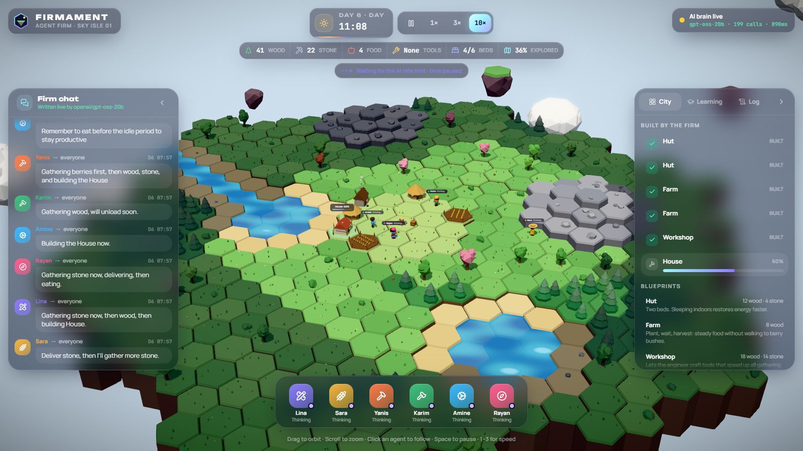
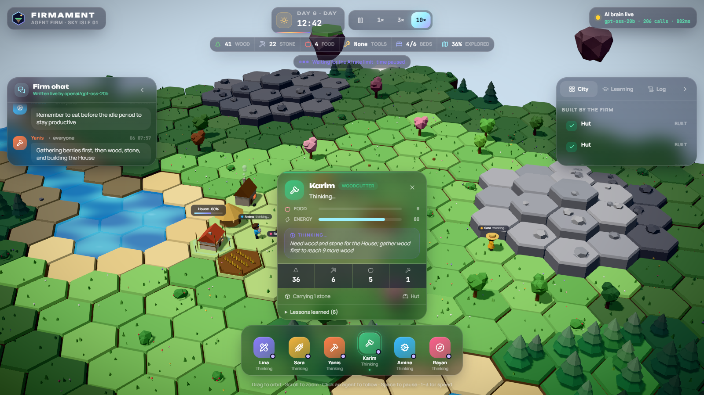
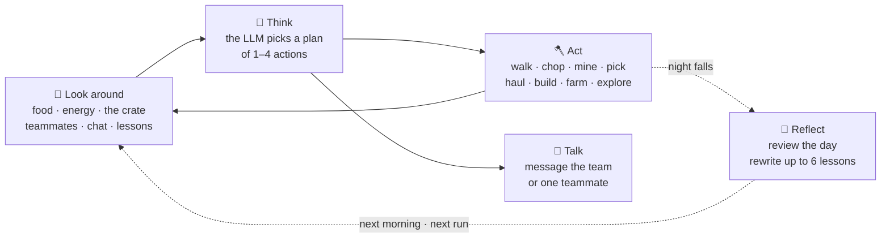
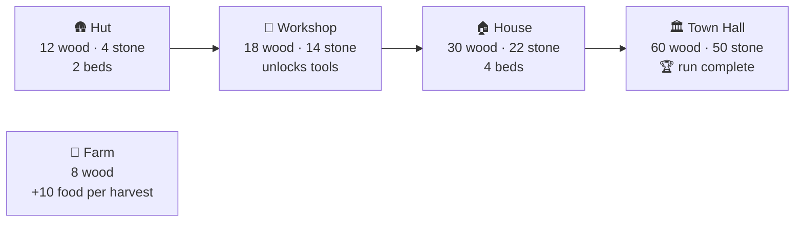
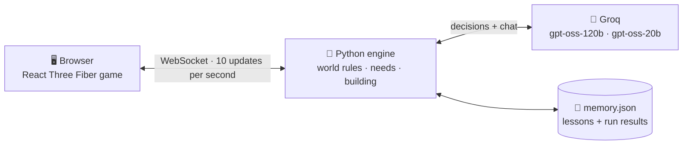

<p align="center">
  
</p>

<p align="center">
  
  
  
  
  
</p>

<h3 align="center">You don't play this game. You watch six AIs play it — and learn.</h3>

---

## 🎮 What is this?

**Firmament** is a living simulation that looks and feels like a game.

Six AI agents wake up on a **floating sky island** with nothing but a campfire and a crate of supplies. Nobody tells them what to do. Each one is driven by a **real large language model**: it looks around, decides its own next moves, talks to the others, and gets to work — chopping trees, mining stone, picking berries, building huts, farms and houses — until they raise a **Town Hall** and the camp becomes a city.

Every night they **reflect on their day** and write down lessons. Those lessons carry into the next day and into the next game. Then the island resets, and we measure whether they build the city **faster than last time**.

<p align="center">
  
  <br><sub><b>Run 1, day 6.</b> Everything you see was decided by the agents: two huts, two farms and a workshop are up, a house is 60% built, and the chat on the left is them coordinating, written live by the model.</sub>
</p>

---

## 🧑‍🤝‍🧑 Select your firm

> Six founders, six classes. Their role shapes how they think — but with a real brain, any of them can pick up any job.

| | Founder | Class | Special ability | Look |
|:-:|---|---|---|---|
| 📐 | **Lina** | Architect | The only one who can mark out a new building — she decides what the city becomes | Ponytail, holographic tablet |
| 🌾 | **Sara** | Farmer | Plants and harvests the farm: +10 food per harvest | Straw hat, braid |
| 🔨 | **Yanis** | Builder | Turns a pile of materials into a standing building | Hard hat, tool belt |
| 🪓 | **Karim** | Woodcutter | Knows the forests; wood is the base of every blueprint | Beard, beanie, axe on his back |
| ⚙️ | **Amine** | Engineer | Mines stone and crafts tools: **everyone gathers 50% faster** | Glowing goggles |
| 🧭 | **Rayan** | Scout | Reveals the map **twice as far** as anyone else | Cap, backpack, bedroll |

<p align="center">
  
  <br><sub>Click any agent to follow them. The card shows their food and energy, <b>what they are thinking right now</b>, their next planned steps, and the lessons they have written for themselves.</sub>
</p>

---

## 🕹️ How a turn works

Each agent runs this loop on its own. No script, no fixed order.



While an agent waits for its answer, **world time pauses** — so a slow API never costs the agents time.

---

## 📜 Rules of the island

The brain decides; the world enforces. No agent can bend these:

| | Rule |
|:-:|---|
| 🍎 | Hunger drops all day. Eat from the crate or straight from a berry bush — or slow down and starve. |
| ⚡ | Energy drops while you work. Everyone sleeps at night; a bed in a hut or house restores you faster than the campfire. |
| 🎒 | You carry at most 5 units. Everything you gather has to be hauled back to the crate. |
| 🏗️ | A building starts only when **all** its materials are in the crate. One construction site at a time. |
| 🌲 | Cut trees regrow after 1.5 days; berry bushes refill slowly. |
| 🌫️ | The island starts in fog. Land is only known once someone walks near it. |
| ⏳ | A run ends when the Town Hall stands — or fails at day 20. |

---

## 🏗️ Tech tree



Lina chooses the order. Build too few beds and people sleep badly; forget the farm and the crate runs out of food. Their choices — and their mistakes — are the game.

---

## 🧠 How they learn

This is not a scripted demo that plays the same way every time. Learning here means three concrete things:

1. **Memory.** Every night each agent gets a summary of its own day — what it did, how long things took, when it went hungry, what it tried and failed — and rewrites a list of at most six practical lessons.
2. **Carry-over.** Those lessons are fed into every later decision: the next day, and the **next run**, where the same island starts over from scratch.
3. **Proof.** Each finished run is scored: the day the Town Hall stood, time spent hungry, share of time actually working. The **Learning** tab charts it run after run. If the line goes down, they learned. If it doesn't, you see that too.

> Real lessons written after their first night: *"Always chop to full carrying limit before unloading."* (Karim) · *"Survey land before gathering to know resource spots."* (Rayan). Some are sharp, some are vague — which is exactly what later runs should sort out.

---

## 🗺️ Level map

| | Stage | What it unlocked | |
|:-:|---|---|:-:|
| 1 | **World & heroes** | The floating hex island, day/night cycle, six hand-built characters, the game HUD | ✅ |
| 2 | **Simulation engine** | Python engine: needs, resources, fog of war, construction, tech tree, live WebSocket stream | ✅ |
| 3 | **Real brains** | LLM decisions, real team chat, nightly reflection, lessons across runs, learning curve | ✅ |
| 4 | **Teamwork & growth** | Sharper coordination, a bigger tech tree, a growing population | 🔒 |
| 5 | **Trained skills** | Small models trained with reinforcement learning on free cloud GPUs | 🔒 |

### 🏆 Achievements

- [x] **First steps** — a 423-tile island generated from a single seed, fully procedural, no downloaded models
- [x] **It's alive** — six agents gathering, hauling, eating and sleeping on their own
- [x] **Their own idea** — Lina chose and marked out the first Hut with no build order given
- [x] **Survived the night** — every agent reflected and wrote its first lessons
- [ ] **Faster the second time** — finish the Town Hall earlier in a later run than in run 1 *(needs more runs — not proven yet)*

---

## ▶️ Press Start

**Player 1 setup** (once):

```bash
npm install
python -m venv engine/.venv
engine/.venv/Scripts/python -m pip install -r engine/requirements.txt
```

**Insert coin** — give the agents a brain with a free Groq key (sign up at [console.groq.com](https://console.groq.com) with an email, no card). Create `engine/.env` (it is git-ignored and never uploaded):

```
GROQ_API_KEY=your_key_here
```

**Start** — two terminals:

```bash
npm run engine
```

```bash
npm run dev
```

Open **http://localhost:5230**. No key? The engine still runs, on a fixed rule list, and the HUD says so.

### ⌨️ Controls

| Input | Action |
|---|---|
| Drag | Orbit the island |
| Scroll | Zoom |
| Click an agent (or the dock) | Follow them and open their card |
| `Space` | Pause / resume |
| `1` `2` `3` | Speed 1× · 3× · 10× |
| `Esc` | Release the camera |

---

## 🔧 Under the hood



| Layer | Built with |
|---|---|
| 3D world | React 19 · React Three Fiber · drei · postprocessing (bloom, tilt-shift) |
| HUD | Tailwind CSS 4 · Motion · zustand · lucide icons |
| Engine | Python · FastAPI · WebSockets · pytest |
| Brain | Groq free tier — `gpt-oss-120b` decides, `gpt-oss-20b` reflects; the client reads rate-limit headers and switches models when one runs out |

```
firmament/
├── engine/firmament/
│   ├── world.py      the seeded island: tiles, lake, river, forests, hills, resources
│   ├── sim.py        time, needs, movement, gathering, construction, runs
│   ├── brain.py      the LLM brain: observations, plans, chat, nightly reflection
│   ├── llm.py        Groq client with rate-limit handling
│   ├── memory.py     lessons + run results, kept between runs
│   ├── policy.py     shared actions + the rule-based fallback
│   └── server.py     HTTP + WebSocket API
├── src/world/        island, props, water, sky, buildings
├── src/agents/       the six characters and their animation
└── src/hud/          chat, city plan, learning chart, agent cards, dock
```

### Honest mode

- Every chat line and decision in LLM mode comes from the model. The HUD shows live call counts, errors and the active model, and turns red if the brain stops answering.
- The free Groq tier allows about **1,000 calls per day per model** — roughly 3–4 full runs a day.
- Learning across runs is built and recording, but **not proven yet**: that needs several finished runs.

---

<p align="center"><sub>Made by <a href="https://github.com/meddadaek">@meddadaek</a> · every building on that island was an AI's idea</sub></p>
